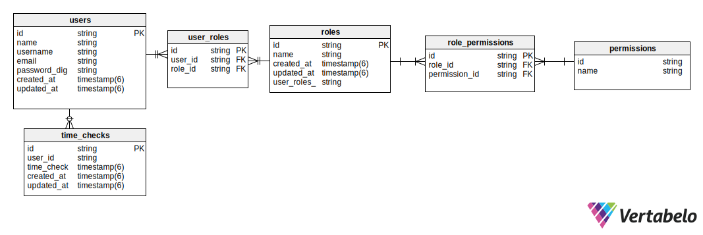

# Clock

Welcome to the Clock API! You can use this API to check in and out from work, and to generate working hours reports.

## Prerequisites

1. Docker

## Installing / Getting Started

1. Clone this repo
2.  `cd clock`
3.  `docker-compose build`
4.  `docker-compose up`

This will start a container with the clock service running.

`curl localhost:3000/clock/alive` to check if the service is running

To access a terminal inside the clock container do `docker exec -it clock bash`

## Running the tests

With the clock container runing: `docker exec -it -e RAILS_ENV=test -e RAKE_ENV=test clock rspec --format d`

## Api Reference

Download the postman collection to get started.

[](https://app.getpostman.com/run-collection/8aa2411ff89b7b998331#?env%5Bclock%5D=W3siZGVzY3JpcHRpb24iOnsiY29udGVudCI6IiIsInR5cGUiOiJ0ZXh0L3BsYWluIn0sInZhbHVlIjoibG9jYWxob3N0Iiwia2V5IjoiQVBJX1VSTCIsImVuYWJsZWQiOnRydWV9LHsiZGVzY3JpcHRpb24iOnsiY29udGVudCI6IiIsInR5cGUiOiJ0ZXh0L3BsYWluIn0sInZhbHVlIjoiMzAwMCIsImtleSI6IkFQSV9QT1JUIiwiZW5hYmxlZCI6dHJ1ZX0seyJkZXNjcmlwdGlvbiI6eyJjb250ZW50IjoiIiwidHlwZSI6InRleHQvcGxhaW4ifSwidmFsdWUiOiJub3JtYWxfdXNlciIsImtleSI6InVzZXJuYW1lIiwiZW5hYmxlZCI6dHJ1ZX0seyJ2YWx1ZSI6IiIsImtleSI6InRva2VuIiwiZW5hYmxlZCI6dHJ1ZX0seyJkZXNjcmlwdGlvbiI6eyJjb250ZW50IjoiIiwidHlwZSI6InRleHQvcGxhaW4ifSwidmFsdWUiOiJBbWVyaWNhL01leGljb19DaXR5Iiwia2V5IjoidGltZXpvbmUiLCJlbmFibGVkIjp0cnVlfV0=)

You can check the API documentation [here](https://web.postman.co/collections/8512686-61d7acff-78ba-44f1-bd76-76f233beea00?workspace=fc5f6f4a-20b8-498d-8615-be611d1b5468#60def236-4f81-478f-a0e9-51f641a7f68f)

## Database

The clock service uses postgres

Schema:

## Authors

*  **Pablo Levy**